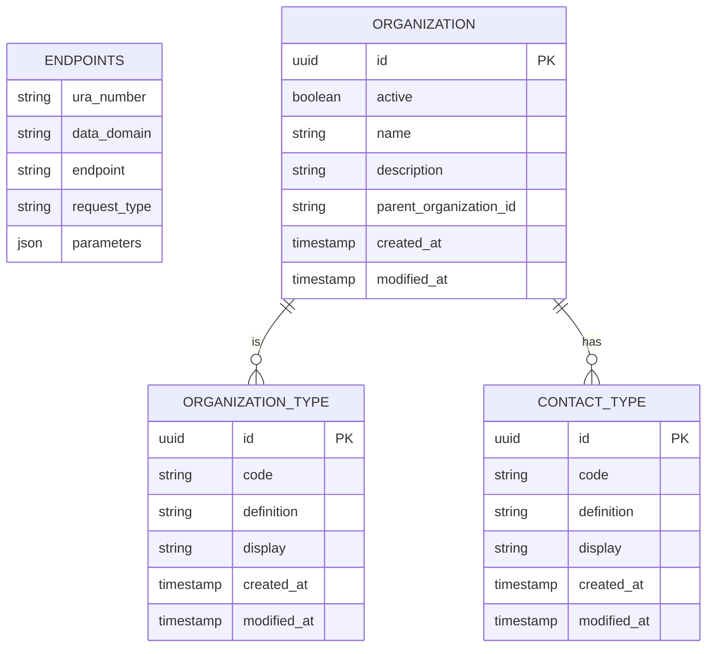

### GFModules Addressing Register

The Addressing Register holds information about various Health Data endpoints that are available
for fetching the metadata. The information of the Addressing Register should be enough for the Timeline
Service or the Health application to fetch the actual metadata.

## Disclaimer

This project and all associated code serve solely as **documentation and demonstration purposes**
to illustrate potential system communication patterns and architectures.

This codebase:

- Is NOT intended for production use
- Does NOT represent a final specification
- Should NOT be considered feature-complete or secure
- May contain errors, omissions, or oversimplified implementations
- Has NOT been tested or hardened for real-world scenarios

The code examples are *only* meant to help understand concepts and demonstrate possibilities.

By using or referencing this code, you acknowledge that you do so at your own risk and that
the authors assume no liability for any consequences of its use.

## Usage

The application is a FastAPI application, so you can use the FastAPI documentation to see how to use the application.

## Development

You can either run the application natively or in a docker container. If you want to run the application natively you
can take a look at the initialisation steps in `docker/init.sh`.

The preferred way to run the application is through docker.

If you run Linux, make sure you export your user ID and group ID to synchronize permissions with the Docker user.

```
export NEW_UID=$(id -u)
export NEW_GID=$(id -g)
```

After this you can simply run `docker compose up`.

The application will be available at <https://localhost:8502> when the startup is completed.

## Models

Database schema:



# Docker container builds

There are two ways to build a docker container from this application. The first is the default mode created with:

    make container-build

This will build a docker container that will run its migrations to the database specified in app.conf.

The second mode is a "standalone" mode, where it will not run migrations, and where you must explicitly specify
an app.conf mount.

    make container-build-sa

Both containers only differ in their init script and the default version usually will mount its own local src directory
into the container's /src dir.

    docker run -ti --rm -p 8502:8502 \
      --mount type=bind,source=./app.conf.autopilot,target=/src/app.conf \
      gfmodules-addressing-register-app
