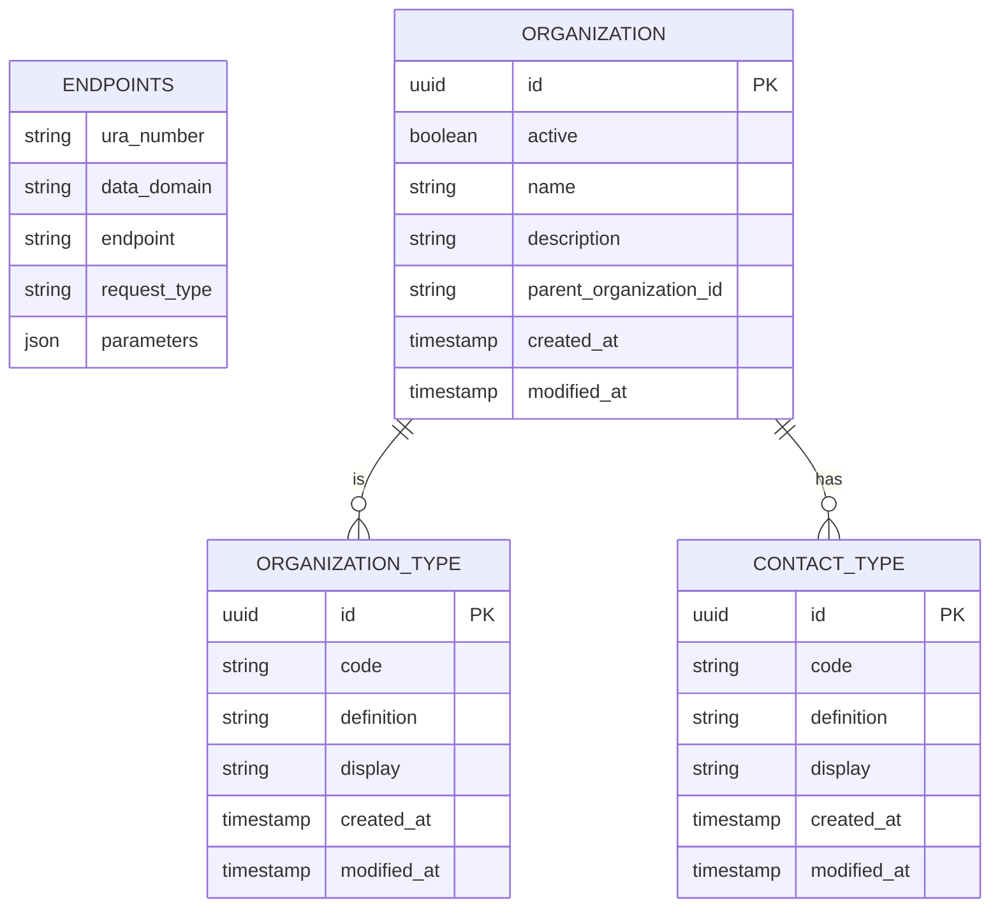

### GFModules Addressing Register

The Addressing Register holds information about various Health Data endpoints that are available
for fetching the metadata. The information of the Addressing Register should be enough for the Timeline
Service or the Health application to fetch the actual metadata.

## Usage

The application is a FastAPI application, so you can use the FastAPI documentation to see how to use the application.

## Development

You can either run the application natively or in a docker container. If you want to run the application natively you
can take a look at the initialisation steps in `docker/init.sh`. 

The preferred way to run the application is through docker.

If you run Linux, make sure you export your user ID and group ID to synchronize permissions with the Docker user.

```
export NEW_UID=$(id -u)
export NEW_GID=$(id -g)
```

After this you can simply run `docker compose up`. 

The application will be available at https://localhost:8502 when the startup is completed.

## Models

Database schema:

