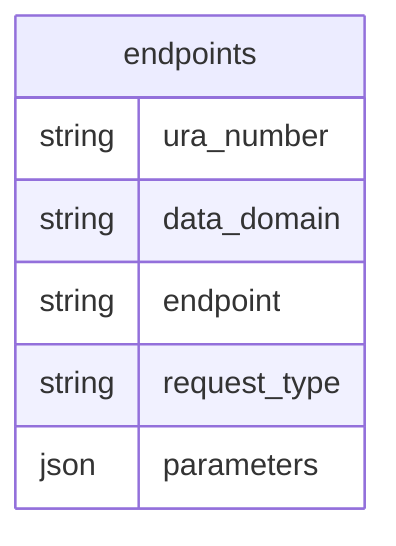

### GFModules Addressing Register

The Addressing Register holds information about various Health Data endpoints that are available
for fetching the metadata. The information of the Addressing Register should be enough for the Timeline
Service or the Health application to fetch the actual metadata.


## First run

If you need to run the application without actual development, you can use the autopilot functionality. When this
repository is checked out, just run the following command:

```bash
make autopilot
```

This will configure the whole system for you and you should be able to use the API right away at http://localhost:8501/docs


## Usage

The application is a FastAPI application, so you can use the FastAPI documentation to see how to use the application.

## Development

Build and run the application

Firstly, copy the `app.conf.example` to `app.conf` and adjust values when needed.
If you run Linux, make sure you export your user ID and group ID to synchronize permissions with the Docker user.

export NEW_UID=$(id -u)
export NEW_GID=$(id -g)

When you're ready, build the application with: make container-build.

Run make up to start the application.

## Models

Database schema:

